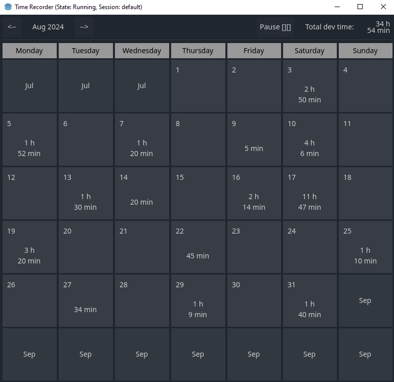
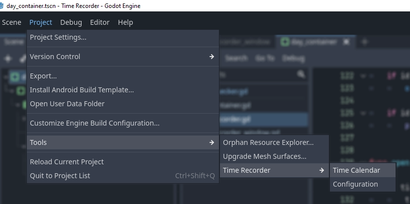
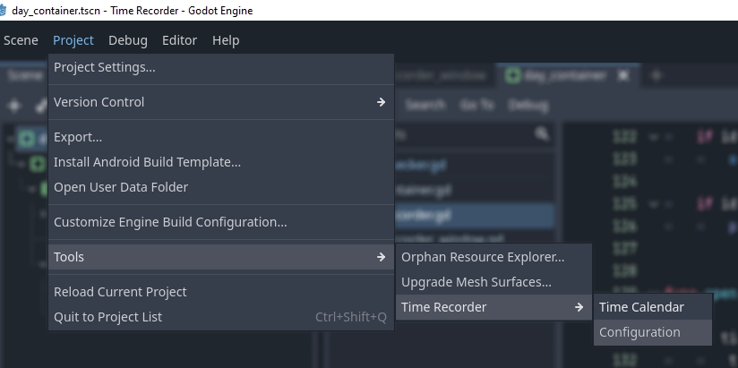
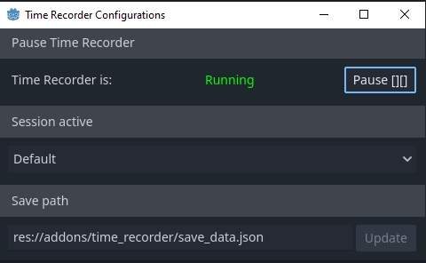
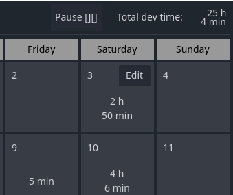
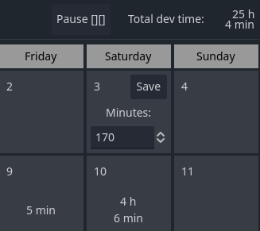

# Godot editor plugin [Time recorder]
Time recoder is an Godot Editor plugin that allow you an easy way to track develop work time while Godot editor is open, track your develop time per project while this plugin is imported.

# Installation

- Copy the [addons/time_recorder](./addons/time_recorder) folder inside your project "addons" folder

# Instructions/requirements
- Make sure only copy [addons/time_recorder](./addons/time_recorder) into your "addons" folder inside your project
- You can change between months with the arrow buttons located in the window header.
- The time that you spend on your project is saved each 5 minutes or when you close your project.
- TimeRecorder automatically start their process on open your Godot Project.
- You can pause TimeRecorder by clicking "pause" in the calendar window or pause window
- *Sessions*, sessions are a way to store time recorded in groups so the time worked during a session will be saved inside it and you can switch between your sessions

You can find the time recorder window at Project/Tools/Time recorder

# Time recorder Configurations

You can find the Time recorder configurations at Project/Tools/Time recorder/Configuration

- You can change the file path where the time worked is saved, default: `res://addons/time_recorder/save_data.json`

- I case you want to restore your time recorded data, you can use a backup file to restore your "Time recorder" data

# Edit time
You can edit each day worked time by hovering the day and clicking the edit button. This function only works with the days of selected month (those days which contains the day number).

Once you clicked the edit button the content of the day will change into an input where you can update the time recoder on that day, the value must be setted as minutes.

after edit the value you can click save and it will restore the state of the element and the total dev time value will be updated also.
